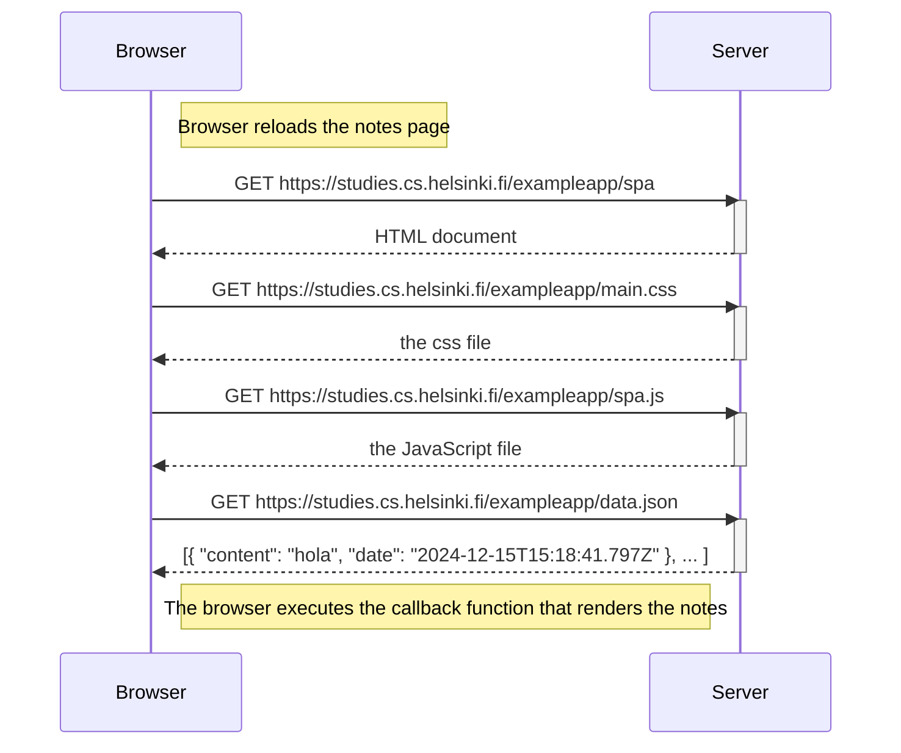

```mermaid
sequenceDiagram
    participant Browser
    participant Server

    Note right of Browser: Browser reloads the notes page
        Browser->>Server: GET https://studies.cs.helsinki.fi/exampleapp/spa
    activate Server
    Server-->>Browser: HTML document
    deactivate Server

    Browser->>Server: GET https://studies.cs.helsinki.fi/exampleapp/main.css
    activate Server
    Server-->>Browser: the css file
    deactivate Server

    Browser->>Server: GET https://studies.cs.helsinki.fi/exampleapp/spa.js
    
    activate Server
    Server-->>Browser: the JavaScript file
    deactivate Server

    Browser->>Server: GET https://studies.cs.helsinki.fi/exampleapp/data.json
    activate Server
    Server-->>Browser: [{ "content": "hola", "date": "2024-12-15T15:18:41.797Z" }, ... ]
    deactivate Server

    Note right of Browser: The browser executes the callback function that renders the notes
```
