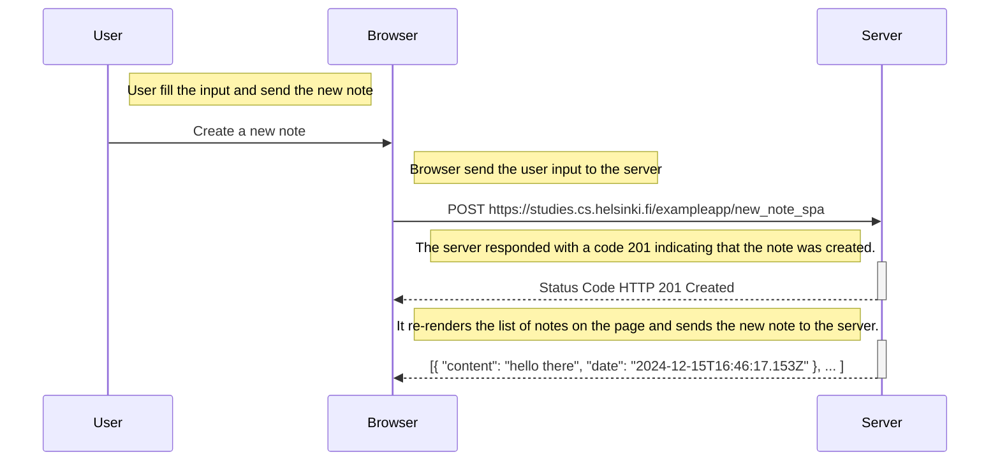

```mermaid
sequenceDiagram
    participant User    
    participant Browser
    participant Server

    Note right of User: User fill the input and send the new note
    User ->> Browser: Create a new note

    Note right of Browser: Browser send the user input to the server
    Browser->>Server: POST https://studies.cs.helsinki.fi/exampleapp/new_note_spa

    Note left of Server: The server responded with a code 201 indicating that the note was created.
    activate Server
    Server-->>Browser: Status Code HTTP 201 Created
    deactivate Server

   
    Note left of Server: It re-renders the list of notes on the page and sends the new note to the server.
    activate Server
    Server-->>Browser: [{ "content": "hello there", "date": "2024-12-15T16:46:17.153Z" }, ... ]
    deactivate Server

```
