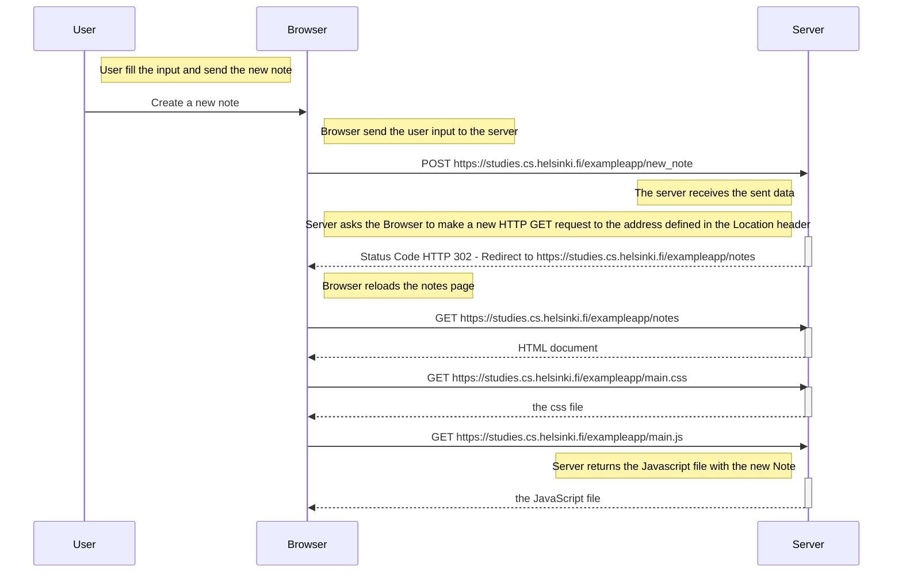

```mermaid
sequenceDiagram
    participant User    
    participant Browser
    participant Server

    Note right of User: User fill the input and send the new note
    User ->> Browser: Create a new note

    Note right of Browser: Browser send the user input to the server
    Browser->>Server: POST https://studies.cs.helsinki.fi/exampleapp/new_note
   
    Note left of Server: The server receives the sent data
    Note left of Server: Server asks the Browser to make a new HTTP GET request to the address defined in the Location header
   activate Server
    Server-->>Browser: Status Code HTTP 302 - Redirect to https://studies.cs.helsinki.fi/exampleapp/notes
    deactivate Server

    Note right of Browser: Browser reloads the notes page
    Browser->>Server: GET https://studies.cs.helsinki.fi/exampleapp/notes
    activate Server
    Server-->>Browser: HTML document
    deactivate Server

    Browser->>Server: GET https://studies.cs.helsinki.fi/exampleapp/main.css
    activate Server
    Server-->>Browser: the css file
    deactivate Server

    Browser->>Server: GET https://studies.cs.helsinki.fi/exampleapp/main.js
    Note left of Server: Server returns the Javascript file with the new Note
    activate Server
    Server-->>Browser: the JavaScript file
    deactivate Server
```
